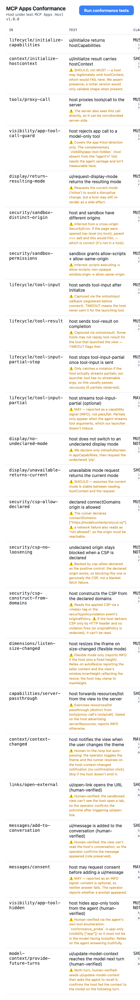

# Conformance server



A **host-conformance test server** for the MCP Apps spec ([SEP-1865 · `2026-01-26`](https://github.com/modelcontextprotocol/ext-apps/blob/main/specification/2026-01-26/apps.mdx), extension id `io.modelcontextprotocol/ui`), modeled on [web-platform-tests](https://web-platform-tests.org).

It ships a single `ui://` test page that renders **inside the host's sandboxed iframe**, drives the `postMessage`/JSON-RPC bridge, asserts the host's behaviour against the spec, and shows `PASS`/`FAIL` right in the iframe.

> **The host is the browser. The `ui://` page is the WPT test. The bridge is `testharness.js`.**

## Run it against a host

Connect a host to this server's `/mcp` endpoint, then prompt the host to call the `run_conformance` tool. The host renders the runner; click **Run conformance tests** to see results.

Start it from the monorepo root:

```bash
npm install
EXAMPLE=conformance-server npm run examples:start   # serves http://localhost:31xx/mcp
```

The console prints the assigned port. Automatic `in-view` checks run on click; the human-in-the-loop (`· manual`) checks prompt you mid-run to take an action (toggle the theme, open a link, send a message) and confirm the outcome.

## How it reads

Each test carries a **vantage**, where the requirement is observable:

- `in-view`, from inside the iframe (this runner asserts it directly)
- `host`, only by inspecting the host's own surface (rendered DOM, the host↔sandbox channel, or the conversation/model) from outside the view
- `server`, only the test server sees it

`· manual` flags a check that needs a **human action** to trigger or verify. ⚠️ flags a measurement caveat in the row. Optional (`MAY`) checks may report an **`INFO`** signal ("does the host do it or not") instead of pass/fail.

The catalogue below covers **only host-directed** normative requirements (the Sandbox proxy is host-side, so its requirements are included). App/View- and server-directed requirements are intentionally excluded. IDs are namespaced by the spec **capability area** (WPT-path style). `✅` = implemented, `⬜` = planned (id reserved).

## Host conformance catalogue

> **24 of 45 host requirements implemented**: `in-view` automatic checks plus six human-in-the-loop (`· manual`) ones: an **auto-detect** check (`context/context-changed`) and five **human-declaration** checks (`links/open-external`, `messages/add-to-conversation`, `messages/consent`, `visibility/app-tool-hidden`, `model-context/provide-future-turns`). `⬜` rows have reserved IDs and need host DOM/channel/log inspection or multi-turn setup.

### `security/`: sandboxing & CSP · §Sandbox proxy, §Host Behavior, §Security Considerations

| ID                                    | Requirement                                                                                                                                                                                                                                                                                                                                                                                                                                                                              | Clause     | Vantage       | Status |
| ------------------------------------- | ---------------------------------------------------------------------------------------------------------------------------------------------------------------------------------------------------------------------------------------------------------------------------------------------------------------------------------------------------------------------------------------------------------------------------------------------------------------------------------------- | ---------- | ------------- | ------ |
| `security/iframe-sandboxed`           | All View content is rendered in sandboxed iframes with restricted permissions. ⚠️ the view can't read its own iframe's `sandbox` attribute (cross-origin), verify by inspecting the host's DOM                                                                                                                                                                                                                                                                                           | MUST       | host          | ⬜     |
| `security/sandbox-proxy-required`     | A web-page host wraps the View behind an intermediate Sandbox proxy. ⚠️ the view can infer frame nesting (`window.parent !== window.top`) but can't verify the proxy, inspect the host's DOM                                                                                                                                                                                                                                                                                             | MUST       | host          | ⬜     |
| `security/sandbox-distinct-origin`    | Host and Sandbox have different origins, reading `window.parent.location` throws                                                                                                                                                                                                                                                                                                                                                                                                         | MUST       | in-view       | ✅     |
| `security/sandbox-permissions`        | Sandbox iframe uses exactly `allow-scripts allow-same-origin`. ⚠️ inferred: scripts run + `window.origin` not opaque                                                                                                                                                                                                                                                                                                                                                                     | MUST       | in-view       | ✅     |
| `security/sandbox-proxy-ready`        | Sandbox sends `ui/notifications/sandbox-proxy-ready` **to the Host** when ready. ⚠️ sandbox↔host message, never forwarded to the view, observe by instrumenting the host↔sandbox channel                                                                                                                                                                                                                                                                                                 | MUST       | host          | ⬜     |
| `security/sandbox-resource-ready`     | Host sends raw HTML via `ui/notifications/sandbox-resource-ready` once the sandbox is ready. ⚠️ sandbox↔host message, not visible to the view                                                                                                                                                                                                                                                                                                                                            | MUST       | host          | ⬜     |
| `security/sandbox-csp-enforced`       | Sandbox loads HTML with CSP enforcing declared domains, `frame-src`, `base-uri`, `object-src 'none'`, restrictive defaults. ⚠️ the `connect-src` slice is covered in-view by `csp-allow-declared`/`csp-no-loosening`; verifying the full applied CSP needs inspecting the host's CSP header                                                                                                                                                                                              | MUST       | host          | ⬜     |
| `security/sandbox-message-forwarding` | Sandbox forwards Host↔View messages for any non-`ui/notifications/sandbox-` method. ⚠️ the view only sees its own end, confirming a message was forwarded and received needs the host to acknowledge (also transitively proven: if forwarding broke, `initialize` would never complete)                                                                                                                                                                                                  | MUST       | host          | ⬜     |
| `security/sandbox-no-self-requests`   | Sandbox does not originate its own requests. ⚠️ observe on the host↔sandbox channel, not from the view                                                                                                                                                                                                                                                                                                                                                                                   | SHOULD NOT | host          | ⬜     |
| `security/csp-construct-from-domains` | Host constructs the CSP from the declared domains, verified by reading the **applied policy** (`<meta>` tag, or the `securitypolicyviolation` event's `originalPolicy`) and checking `connect-src` includes the declared domain. ⚠️ unreadable if the host uses a header-only CSP that never fires a violation                                                                                                                                                                           | MUST       | in-view       | ✅     |
| `security/csp-default-deny`           | With **no** `ui.csp`, host applies the restrictive default (`connect-src 'none'`, …). ⚠️ needs a dedicated **no-CSP** resource, the current runner declares a CSP, so this "omitted" path isn't exercised                                                                                                                                                                                                                                                                                | MUST       | in-view       | ⬜     |
| `security/csp-allow-declared`         | A declared `connectDomains` origin is permitted. The runner declares `connectDomains: ["https://modelcontextprotocol.io"]`. ⚠️ this is a **positive control** for `csp-construct-from-domains`/`csp-no-loosening`, not an independent normative MUST, the spec lets a host **further restrict** declared domains (§UI Resource Format → No Loosening), so a compliant host could legitimately block this; a network failure also reads as "not allowed", so the origin must be reachable | MUST       | in-view       | ✅     |
| `security/csp-no-loosening`           | Even with a CSP declared, an **undeclared** origin stays blocked. Backed by `csp-allow-declared` as the positive control, so the block is genuinely the CSP                                                                                                                                                                                                                                                                                                                              | MUST NOT   | in-view       | ✅     |
| `security/permissions-allow-attr`     | Sandbox sets the inner iframe `allow` attribute from declared permissions. ⚠️ the `allow` attribute lives on the cross-origin parent's iframe, inspect the host's DOM (feature detection from the view is gesture-gated and doesn't confirm the attribute)                                                                                                                                                                                                                               | MAY        | host          | ⬜     |
| `security/csp-audit-log`              | Host logs CSP configurations for security review. ⚠️ inspect the host's logs                                                                                                                                                                                                                                                                                                                                                                                                             | SHOULD     | host · manual | ⬜     |
| `security/external-domain-warning`    | Host warns the user when the UI **requires external-domain network access**, a resource that declares `connectDomains` to a third-party origin (Security Considerations §CSP). ⚠️ tied to CSP/`connectDomains` at connection time, **not** to `ui/open-link` (which has no warning clause); needs a resource declaring an external connect domain + host-surface inspection                                                                                                              | SHOULD     | host · manual | ⬜     |
| `security/global-allowlist`           | Host applies global domain allow/block lists. ⚠️ configure host policy, then verify                                                                                                                                                                                                                                                                                                                                                                                                      | MAY        | host · manual | ⬜     |

### `lifecycle/`: handshake & tool notifications · §Lifecycle, §Data Passing

| ID                                  | Requirement                                                                                                                                                                                              | Clause | Vantage          | Status |
| ----------------------------------- | -------------------------------------------------------------------------------------------------------------------------------------------------------------------------------------------------------- | ------ | ---------------- | ------ |
| `lifecycle/initialize-capabilities` | Host responds to `ui/initialize` with `hostCapabilities` in `McpUiInitializeResult`                                                                                                                      | MUST   | in-view          | ✅     |
| `lifecycle/tool-input`              | Host sends `ui/notifications/tool-input` with complete arguments after the View's initialize completes (via `ontoolinput`)                                                                               | MUST   | in-view          | ✅     |
| `lifecycle/tool-input-partial`      | Host may stream `ui/notifications/tool-input-partial` before `tool-input`. Reported as a capability **signal** (runtime `INFO`, not pass/fail). ⚠️ partials only appear when the agent streams tool args | MAY    | in-view          | ✅     |
| `lifecycle/tool-input-partial-stop` | Host stops sending `ui/notifications/tool-input-partial` once `tool-input` is sent. ⚠️ only catches a violation if the host streams partials (our launcher has none), so usually passes vacuously        | MUST   | in-view          | ✅     |
| `lifecycle/tool-result`             | Host sends `ui/notifications/tool-result` when execution completes (if the View is displayed; via `ontoolresult`)                                                                                        | MUST   | in-view          | ✅     |
| `lifecycle/tool-cancelled`          | Host sends `ui/notifications/tool-cancelled` if execution is cancelled. Captured in-view via `ontoolcancelled`; the user must cancel a running tool                                                      | MUST   | in-view · manual | ⬜     |
| `lifecycle/teardown-notify`         | Host sends a teardown notification before tearing down the View. Captured in-view via `onteardown`; the user must close/replace the view                                                                 | MUST   | in-view · manual | ⬜     |
| `lifecycle/teardown-await`          | Host waits for a response before tearing down (to prevent data loss). In-view via a delayed `onteardown` response; the user must trigger teardown                                                        | SHOULD | in-view · manual | ⬜     |

### `tools/` & `visibility/`: proxying & tool exposure · §Resource Discovery, §Visibility

| ID                               | Requirement                                                                                                                                                                                                                                                                                   | Clause   | Vantage       | Status |
| -------------------------------- | --------------------------------------------------------------------------------------------------------------------------------------------------------------------------------------------------------------------------------------------------------------------------------------------- | -------- | ------------- | ------ |
| `tools/proxy-call`               | Host proxies `tools/call` from the View to the server and returns the result. The spec only states the host **MAY** forward non-`ui/` messages to the server (§Sandbox proxy); proxying is a functional expectation **once the host advertises `serverTools`**. Also corroborated server-side | MAY      | in-view       | ✅     |
| `visibility/app-tool-hidden`     | Host excludes tools lacking `"model"` visibility from the agent's `tools/list`. The app asks the agent (via `ui/message`) to enumerate the conformance server's tools; operator confirms the app-only `conformance_probe` is absent                                                           | MUST NOT | host · manual | ✅     |
| `visibility/app-tool-call-guard` | Host rejects `tools/call` from apps for tools that don't include `"app"` visibility                                                                                                                                                                                                           | MUST     | in-view       | ✅     |

### `resources/`: UI resource fetching · §Resource Discovery

| ID                          | Requirement                                                                                           | Clause | Vantage | Status |
| --------------------------- | ----------------------------------------------------------------------------------------------------- | ------ | ------- | ------ |
| `resources/read-referenced` | Host fetches the referenced UI resource via `resources/read`. ⚠️ observed by the server, not the view | MUST   | server  | ⬜     |
| `resources/prefetch`        | Host may prefetch/cache UI resource content. ⚠️ server-observed                                       | MAY    | server  | ⬜     |

### `context/`: host context & change notifications · §Host Context, §Theming

| ID                               | Requirement                                                                                                                                                             | Clause | Vantage          | Status |
| -------------------------------- | ----------------------------------------------------------------------------------------------------------------------------------------------------------------------- | ------ | ---------------- | ------ |
| `context/initialize-hostcontext` | Host includes `hostContext` in `McpUiInitializeResult`. ⚠️ SHOULD, a host may legitimately omit it                                                                      | SHOULD | in-view          | ✅     |
| `context/context-changed`        | Host emits `ui/notifications/host-context-changed` when context fields change. Captured in-view via `onhostcontextchanged`; the user must change the theme/display mode | MAY    | in-view · manual | ✅     |

### `dimensions/`: sizing · §Container Dimensions

| ID                               | Requirement                                                                                                                                                                                                                                                                          | Clause | Vantage | Status |
| -------------------------------- | ------------------------------------------------------------------------------------------------------------------------------------------------------------------------------------------------------------------------------------------------------------------------------------ | ------ | ------- | ------ |
| `dimensions/listen-size-changed` | In flexible mode, host resizes the iframe on `ui/notifications/size-changed`. Observed by growing the content and watching the view's own `window.innerHeight` grow. ⚠️ flexible mode only (INFO if the host pins a fixed height); relies on autoResize; host may clamp to maxHeight | MUST   | in-view | ✅     |

### `display/`: display modes · §Display Modes

| ID                                    | Requirement                                                                    | Clause   | Vantage | Status |
| ------------------------------------- | ------------------------------------------------------------------------------ | -------- | ------- | ------ |
| `display/no-undeclared-mode`          | Host never switches the View to a mode absent from its `availableDisplayModes` | MUST NOT | in-view | ✅     |
| `display/return-resulting-mode`       | Host returns the resulting mode in the `ui/request-display-mode` response      | MUST     | in-view | ✅     |
| `display/unavailable-returns-current` | If the requested mode is unavailable, host returns the current mode            | SHOULD   | in-view | ✅     |
| `display/decline-undeclared`          | Host may decline mode requests for modes the View didn't declare               | MAY      | in-view | ⬜     |

### `links/`, `messages/`, `model-context/`: View→Host requests · §MCP Apps Specific Messages

| ID                                             | Requirement                                                                                                                                        | Clause | Vantage       | Status |
| ---------------------------------------------- | -------------------------------------------------------------------------------------------------------------------------------------------------- | ------ | ------------- | ------ |
| `links/open-external`                          | Host opens a `ui/open-link` URL in the user's default browser or a new tab. ⚠️ side effect outside the iframe, operator confirms the opened tab    | SHOULD | host · manual | ✅     |
| `messages/add-to-conversation`                 | Host adds a `ui/message` to the conversation context, preserving the role. App triggers `ui/message`; operator confirms it appeared                | SHOULD | host · manual | ✅     |
| `messages/consent`                             | Host may request user consent for a `ui/message`. App triggers `ui/message`; operator reports whether a consent prompt showed (INFO, optional)     | MAY    | host · manual | ✅     |
| `model-context/provide-future-turns`           | Host provides `ui/update-model-context` to the model in future turns. App seeds a secret code then asks the agent for it; operator confirms recall | SHOULD | host · manual | ✅     |
| `model-context/last-wins`                      | If several updates arrive before the next user message, host sends only the last. ⚠️ multi-turn                                                    | SHOULD | host · manual | ⬜     |
| `model-context/overwrite-defer-dedupe-display` | Host may overwrite / defer / dedupe / display context updates. ⚠️ multi-turn / UX                                                                  | MAY    | host · manual | ⬜     |

### `capabilities/`: negotiation & forwarding · §Capability Negotiation, §Sandbox proxy

| ID                                | Requirement                                                                                                                                                                                                                                  | Clause       | Vantage | Status |
| --------------------------------- | -------------------------------------------------------------------------------------------------------------------------------------------------------------------------------------------------------------------------------------------- | ------------ | ------- | ------ |
| `capabilities/mimetypes-required` | Host's UI capability declaration includes `mimeTypes`. ⚠️ negotiation, server-observed                                                                                                                                                       | REQUIRED     | server  | ⬜     |
| `capabilities/server-passthrough` | Host forwards non-`ui/` MCP methods from the view to the server. Tested via `resources/list` (`listServerResources` → expects `ui://conformance/runner` back), distinct from `tools/proxy-call`. Gated on `serverResources` (INFO otherwise) | MAY · SHOULD | in-view | ✅     |

## Layout

- `server.ts`, the MCP server: one `ui://` runner resource + fixture tools (`run_conformance` launcher, app-only `conformance_probe`, model-only `model_only_probe`)
- `main.ts`, Streamable HTTP / stdio entry point
- `mcp-app.html` + `src/`, the React runner: `mcp-app.tsx` (UI) + `testharness.ts` (the `mcp_test()` harness) + `tests.ts` (the catalogue, in code)
